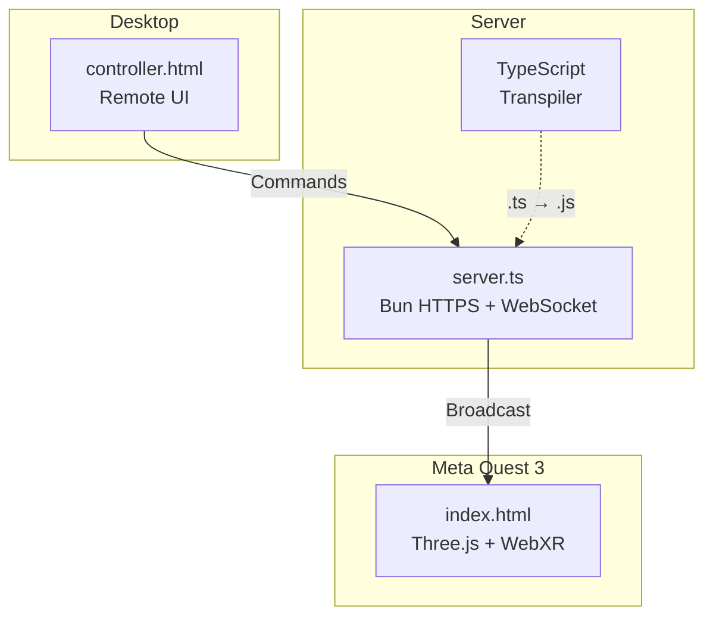

# WebXR Starter Template

A minimal WebXR development template for Meta Quest 3 with Three.js, featuring remote control via WebSocket.

## Architecture



**Key Feature:** Control the VR/AR scene from any browser while viewing on Quest.

---

## Quick Start

```bash
# 1. Install dependencies
bun install

# 2. Generate HTTPS certificates (required for WebXR)
bunx mkcert localhost

# 3. Start everything (server + controller + Quest browser)
./start.sh vr
```

---

## Connection Methods

### Option 1: USB-C + ADB (Recommended)

Best for corporate networks where Quest can't connect to WiFi.

```bash
# Prerequisites
brew install android-platform-tools   # Install ADB (once)
# Enable Developer Mode on Quest via Meta app

# Setup (each session)
adb devices                           # Verify connection
adb reverse tcp:3000 tcp:3000         # Port forwarding

# Start
./start.sh vr                         # or: ./start.sh ar
```

### Option 2: WiFi (Same Network)

```bash
# Find your IP
ipconfig getifaddr en0

# Start server
bun --hot ./server.ts

# On Quest browser, open:
# https://[YOUR_IP]:3000/?mode=vr
```

---

## Project Structure

```
├── server.ts              # Bun HTTPS server + WebSocket + TS transpiler
├── index.html             # VR/AR scene entry point
├── controller.html        # Remote control UI (touch/mouse/keyboard)
├── start.sh               # One-command startup script
├── src/
│   └── main.ts            # Three.js scene + WebXR + command handler
├── docs/
│   ├── ARCHITECTURE.md    # Technical deep-dive
│   └── TUTORIAL.md        # Step-by-step guide
├── localhost.pem          # HTTPS certificate (generated)
└── localhost-key.pem      # HTTPS private key (generated)
```

---

## Commands

| Command | Description |
|---------|-------------|
| `./start.sh vr` | Start server + open controller + launch Quest browser (VR) |
| `./start.sh ar` | Same as above, but AR mode |
| `bun --hot ./server.ts` | Start server only (with hot reload) |
| `bunx biome check --write .` | Lint and format code |
| `bunx tsc --noEmit` | TypeScript type check |

---

## Technology Stack

| Component | Technology | Rationale |
|-----------|------------|-----------|
| Runtime | **Bun** | Fast all-in-one JS runtime |
| Server | **Bun.serve()** | Built-in HTTPS + WebSocket |
| 3D Engine | **Three.js** | Industry standard for WebXR |
| VR/AR API | **WebXR Device API** | W3C standard |
| Transpiler | **Bun.Transpiler** | On-the-fly TS → JS |
| Linting | **Biome** | Fast ESLint + Prettier replacement |

---

## WebSocket Protocol

### Movement Command
```json
{
  "type": "move",
  "axis": "x" | "y" | "z",
  "value": 0.1
}
```

### Color Command
```json
{
  "type": "color",
  "color": "red" | "green" | "blue"
}
```

---

## Key Learnings

### WebXR Requirements
- **HTTPS is mandatory** - WebXR API is blocked on HTTP
- Use `renderer.setAnimationLoop()` not `requestAnimationFrame`
- Three.js imports must be explicit: `three/examples/jsm/webxr/VRButton.js`

### TypeScript in Browser
- Browsers can't parse `.ts` files directly
- Solution: `Bun.Transpiler` converts TS → JS on-the-fly in `server.ts`
- No build step required

### Quest Browser Auto-Launch
```bash
adb shell am start -a android.intent.action.VIEW \
  -d "https://localhost:3000" com.oculus.browser
```

---

## Documentation

- [Architecture Reference](docs/ARCHITECTURE.md) - Technical deep-dive with diagrams
- [Tutorial](docs/TUTORIAL.md) - Step-by-step guide for beginners

---

## License

MIT
