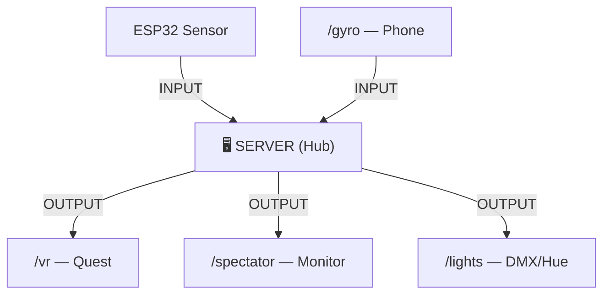

# ✈️ ICAROS VR Flight Sim

> WebXR flight simulation for **Meta Quest** + **ICAROS** fitness device

Fly through procedural low-poly landscapes using body-based pitch and roll input. This project provides a complete WebSocket pipeline, terrain generation, and flight physics.

---

## 🎯 What is this?

A **teaching project** that demonstrates:
- **WebXR** — Immersive VR in the browser (no app store)
- **WebSocket communication** — Real-time data between devices
- **Three.js** — 3D graphics in JavaScript
- **Device sensors** — Gyroscope, accelerometer via browser APIs

The ICAROS fitness device provides body-based flight control:
- **Pitch** (lean forward/back) → climb / dive
- **Roll** (lean left/right) → bank / turn

---

## 🏗️ Architecture



**Key principle:** All data flows through the server. No direct client-to-client communication.

---

## 🚀 Quick Start

### Prerequisites

```bash
# 1. Install Bun (runtime)
curl -fsSL https://bun.sh/install | bash

# 2. Install mkcert (HTTPS certificates)
brew install mkcert    # Mac
mkcert -install

# 3. Install ADB (Quest connection)
brew install android-platform-tools    # Mac
```

> 📖 Full setup for Windows/Linux: [docs/SETUP.md](docs/SETUP.md)

### Run the Project

```bash
# Clone & install
git clone https://github.com/dweigend/neural-flight-template.git
cd neural-flight-template
bun install

# Generate HTTPS certificates (required for WebXR)
mkcert localhost

# Start dev server
bun run dev
```

### Connect Meta Quest

```bash
# 1. Connect Quest via USB-C cable
adb devices              # Should show your device

# 2. Forward local port to Quest
adb reverse tcp:5173 tcp:5173

# 3. Open on Quest Browser
# https://localhost:5173/vr → Click "Enter VR"
```

---

## 📍 Routes

| Route | Device | Purpose |
|-------|--------|---------|
| `/` | Any | 🏠 Landing page with architecture diagram |
| `/vr` | Quest | 🥽 WebXR flight scene (Three.js) |
| `/gyro` | Phone | 📱 Gyroscope controller (ICAROS) |
| `/controller` | Laptop | 🎮 D-Pad controller + Settings |
| `/node-editor` | Laptop | 🔧 Visual node editor for VR parameters |
| `/spectator` | Monitor | 👀 External display *(planned)* |

---

## 📁 Project Structure

```
src/
├── routes/
│   ├── +page.svelte              # Landing page
│   ├── vr/+page.svelte           # WebXR flight scene
│   ├── gyro/+page.svelte         # Gyroscope controller
│   ├── controller/+page.svelte   # Desktop controller
│   └── node-editor/+page.svelte  # Visual node editor
│
├── lib/
│   ├── three/                    # 🎮 Three.js modules
│   │   ├── scene.ts              # Scene factory (lights, fog)
│   │   ├── player.ts             # FlightPlayer (camera + physics)
│   │   ├── sky.ts                # Low-poly gradient sky
│   │   ├── clouds.ts             # Procedural cloud groups
│   │   ├── rings.ts              # Collectible rings
│   │   └── terrain/              # Chunked terrain system
│   │       ├── manager.ts        # Chunk loading/unloading
│   │       ├── chunk.ts          # Single terrain chunk
│   │       ├── heightmap.ts      # Noise-based height generation
│   │       ├── geometry.ts       # Mesh + vertex colors
│   │       ├── decorations.ts    # Trees, rocks (instanced)
│   │       └── water.ts          # Water plane
│   │
│   ├── ws/                       # 📡 WebSocket
│   │   ├── server.ts             # Server-side handler
│   │   ├── client.svelte.ts      # Client-side hook (Svelte 5)
│   │   └── protocol.ts           # Message parsing/validation
│   │
│   ├── gyro/                     # 📱 Device Orientation
│   │   ├── orientation.svelte.ts # Gyro hook with calibration
│   │   └── calibration.ts        # Offset storage
│   │
│   ├── config/                   # ⚙️ Configuration
│   │   └── flight.ts             # All tuning constants
│   │
│   ├── node-editor/              # 🔧 Visual node editor (Eurorack architecture)
│   │   ├── components/           # Atomic signal processors
│   │   ├── nodes/                # Node compositions (modules)
│   │   ├── canvas/               # SvelteFlow infrastructure
│   │   ├── controls/             # UI primitives (bits-ui)
│   │   ├── graph/                # Compute engine (headless)
│   │   ├── parameters/           # VR parameter registry
│   │   └── bridge.ts             # WebSocket → Three.js
│   │
│   ├── components/               # 🎨 UI components (bits-ui)
│   └── types/                    # 📝 TypeScript interfaces
│
├── hooks.server.ts               # WebSocket upgrade handler
└── app.css                       # Global design system
```

---

## 📡 WebSocket Protocol

All messages are JSON with a `type` field for routing.

### Message Types

```typescript
// 1. Orientation data (from gyro/controller)
interface OrientationData {
  type: "orientation";
  pitch: number;      // -90 to 90 (forward/back lean)
  roll: number;       // -90 to 90 (left/right lean)
  timestamp: number;
}

// 2. Speed commands (accelerate/brake buttons)
interface SpeedCommand {
  type: "speed";
  action: "accelerate" | "brake";
  active: boolean;
  timestamp: number;
}

// 3. Settings update (from sidebar)
interface SettingsUpdate {
  type: "settings";
  settings: Record<string, number | boolean | string>;
  timestamp: number;
}
```

### Data Flow

```
┌──────────────┐     WebSocket      ┌──────────────┐     WebSocket      ┌──────────────┐
│  Controller  │ ─────────────────▶ │    Server    │ ─────────────────▶ │   VR Scene   │
│  (/gyro)     │   OrientationData  │ (broadcasts) │   OrientationData  │   (/vr)      │
└──────────────┘                    └──────────────┘                    └──────────────┘
```

---

## ⚙️ Configuration

All tuning parameters live in `src/lib/config/flight.ts`:

| Constant | Purpose |
|----------|---------|
| `FLIGHT` | Speed, physics, spawn position |
| `CONTROLS` | Input sensitivity, button mappings |
| `TERRAIN` | Chunk size, noise parameters, water level |
| `RINGS` | Collectible appearance and behavior |
| `SCENE` | Lighting, fog distances |
| `CLOUDS` | Count, height, drift speed |
| `SKY` | Gradient colors |

### Runtime Config

Some parameters can be changed live via the Settings Sidebar:
- Base speed, roll sensitivity
- Fog near/far distances
- Cloud count, drift enable/disable
- Sky colors, sun elevation
- Terrain amplitude, water level

---

## ✏️ For Students: How to Extend

### Add a New Input Source

1. Create a new route: `src/routes/your-input/+page.svelte`
2. Connect to WebSocket using `createWebSocketClient()` from `$lib/ws/client.svelte.ts`
3. Send `OrientationData` messages with your input values

```svelte
<script lang="ts">
  import { createWebSocketClient } from '$lib/ws/client.svelte.ts';

  const ws = createWebSocketClient();

  function sendOrientation(pitch: number, roll: number) {
    ws.send({
      type: 'orientation',
      pitch,
      roll,
      timestamp: Date.now()
    });
  }
</script>
```

### Add a New Output Client

1. Create a route: `src/routes/your-output/+page.svelte`
2. Connect to WebSocket and listen for messages
3. React to `OrientationData` in your visualization

### Modify the VR World

Files to explore:
- `src/lib/three/terrain/` — Change landscape generation
- `src/lib/three/sky.ts` — Modify sky appearance
- `src/lib/three/rings.ts` — Add new collectibles
- `src/lib/config/flight.ts` — Tune all parameters

### Add a New Message Type

1. Define interface in `src/lib/types/orientation.ts`
2. Add type guard in `src/lib/ws/protocol.ts`
3. Handle in both sender and receiver

---

## 🛠️ Development Commands

```bash
bun run dev                            # Start HTTPS dev server
bunx biome check --write .             # Lint + format code
bunx svelte-check --threshold warning  # Type check
```

---

## ⚠️ Troubleshooting

### "WebXR not available"
- WebXR requires HTTPS — use `bun run dev` (auto-HTTPS)
- Quest Browser only, not mobile browsers

### "Connection refused" on Quest
```bash
adb reverse tcp:5173 tcp:5173   # Re-establish tunnel
adb reverse --list              # Verify tunnel exists
```

### Gyroscope not working on phone
- HTTPS required for Device Orientation API
- iOS: Settings → Safari → Motion & Orientation Access → Enable
- Some browsers need a user gesture first (tap screen)

### High latency
- Use USB connection instead of Wi-Fi
- Close other Quest browser tabs
- Check WebSocket connection in browser DevTools

---

## 🔧 Tech Stack

| Component | Tool |
|-----------|------|
| Framework | SvelteKit |
| Runtime | Bun |
| 3D Engine | Three.js |
| VR/AR | WebXR API |
| UI | bits-ui |
| Linting | Biome |

---

## 📚 More Documentation

- [**SETUP.md**](docs/SETUP.md) — Full installation guide (Windows/Linux/Mac)
- [**CUSTOMIZATION.md**](docs/CUSTOMIZATION.md) — Detailed customization guide
- [**ARCHITECTURE.md**](docs/ARCHITECTURE.md) — System design deep-dive

---

## 📄 License

MIT
