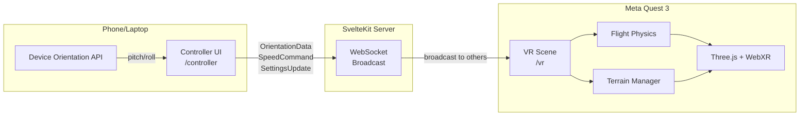
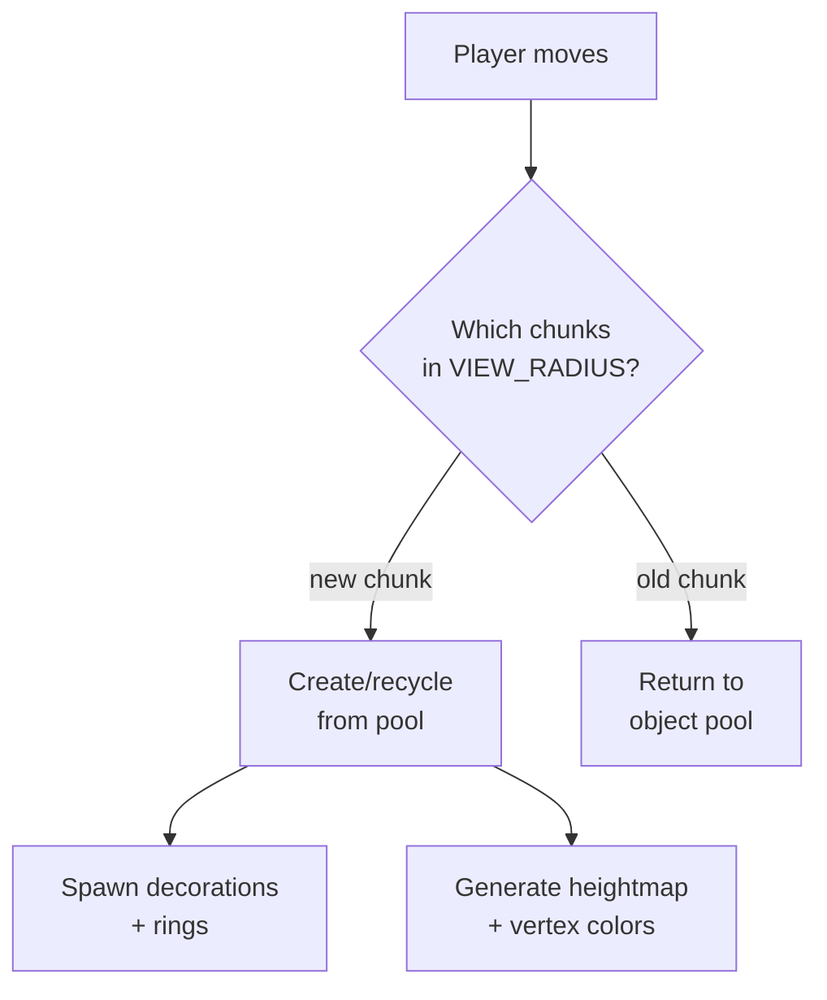

# 🏗️ Architecture

System design for the ICAROS VR Teaching Platform.

---

## System Overview



## Three Layers

```
┌─────────────────────────────────────────────────┐
│  Experiences (student-built VR worlds)          │
│  Manifest → Catalog → Loader lifecycle          │
├─────────────────────────────────────────────────┤
│  Prototyping Tools                              │
│  Node Editor + Shader Playground                │
├─────────────────────────────────────────────────┤
│  Infrastructure                                 │
│  WebXR, WebSocket, Controllers, SvelteKit       │
└─────────────────────────────────────────────────┘
```

## Data Flow

```
ICAROS Device
    ↓ body lean (pitch + roll)
Phone (Device Orientation API)
    ↓ OrientationData @ 60Hz
Controller UI (/controller)
    ↓ WebSocket (WSS)
SvelteKit Server (hooks.server.ts)
    ↓ broadcast to all except sender
VR Scene (/vr on Quest)
    ↓ Experience.tick()
Three.js Render Loop @ 72fps
```

## Module Architecture

### Routes

| Route | Responsibility |
|-------|---------------|
| `/` | Experience Catalog — select a VR world |
| `/vr` | WebXR canvas, loads active experience, animation loop |
| `/controller` | D-Pad input, speed buttons, 3D preview, settings sidebar |
| `/node-editor` | Visual node editor — modular signal pipeline for VR parameter control |
| `/shader-playground` | Live TSL shader editor with signal-based modules and 3D preview |

### `lib/experiences/` — Experience System

Each experience is a self-contained VR world with 5 files:

```
manifest.ts  ── Declarative I/O contract (parameters, scene config)
scene.ts ────── 3D objects + animation (setup, tick, dispose)
player.ts ───── Orientation → movement mapping
settings.ts ─── Parameter ID → scene mutation
index.ts ────── Re-export entry point
```

- **Catalog** registers all experiences (students add 1 import + 1 line)
- **Loader** manages lifecycle: load → tick → dispose
- **Manifest** defines parameters that appear in Settings Sidebar + Node Editor

### `lib/three/` — Shared 3D Building Blocks

```
scene.ts ─── Scene factory (lights, fog)
player.ts ── FlightPlayer (rig + camera + arcade physics)
sky.ts ───── Low-poly sky dome (vertex-color gradient)
clouds.ts ── Procedural cloud groups (drift animation)
rings.ts ─── Per-chunk collectible rings
loader.ts ── GLTF loader wrapper

terrain/
├── manager.ts ──── Chunk load/unload + object pooling
├── chunk.ts ────── Single 128×128 terrain tile
├── geometry.ts ─── Heightmap → BufferGeometry
├── heightmap.ts ── Simplex noise FBM (5 octaves)
├── water.ts ────── Flat water plane
└── decorations.ts  InstancedMesh trees + rocks
```

### `lib/ws/` — WebSocket

```
client.svelte.ts ── Reactive client (Svelte 5 $state, auto-reconnect)
server.ts ───────── Broadcast-to-others handler
protocol.ts ─────── Serialization + type guard validation
```

### `lib/config/` — Config-Driven Design

All tuning values live in `flight.ts` — a single file with `as const` objects. Modules import what they need, never hardcode values.

**Runtime config**: A mutable copy of defaults can be changed live via `SettingsUpdate` WebSocket messages from the controller sidebar. This enables real-time tuning without code changes.

### `lib/node-editor/` — Visual Node Editor

Modular signal system (Eurorack architecture). See [`src/lib/node-editor/README.md`](../src/lib/node-editor/README.md) for full details.

```
components/   Atomic signal processors (12 Logic + 11 UI)
nodes/        Node compositions (9 standard + 8 auto-generated output)
canvas/       SvelteFlow infrastructure (EditorCanvas, NodeShell, Catalog)
controls/     UI primitives (bits-ui based, signal-unaware)
graph/        Headless compute engine (SignalGraph, evaluate)
parameters/   VR parameter registry (dynamic from manifest)
bridge.ts     WebSocket → Three.js (numbers only)
```

### `lib/shader-playground/` — Shader Playground

Signal-based TSL shader editor with 3D preview. See [`src/lib/shader-playground/README.md`](../src/lib/shader-playground/README.md) for full details.

```
modules/      24 shader modules (4 control + 10 vertex + 10 fragment)
components/   Rack UI, Preview, CodeView
engine/       TSL renderer + Three.js integration
codegen.ts    Module chain → TSL node composition
state.svelte.ts  Reactive state (Svelte 5 Runes)
```

Pipeline: `Module[] → codegen → TSL nodes → renderer → 3D Preview`

### `lib/components/` — Svelte UI

```
ControlPad.svelte ──────── D-Pad for pitch/roll
SpeedButtons.svelte ────── Accelerate/Brake
IcarosPreview.svelte ───── 3D model preview (reactive to input)
SettingsSidebar.svelte ─── Runtime config sliders/switches
PageHeader.svelte ──────── Page title + subtitle
LinkCard.svelte ────────── Navigation card with icon
DataTable.svelte ───────── Key-value data display
ArchitectureDiagram.svelte  ASCII architecture diagram
NodeEditorPreview.svelte ── Node editor preview card
```

## Terrain Chunk System



- **Chunk size**: 128×128 units, 32 segments (visible facets)
- **View radius**: 2 chunks in each direction
- **Object pool**: max 30 recycled chunks (prevents GC pressure)
- **Seeded random**: chunk coordinates → deterministic placement
- **Per-chunk data**: terrain mesh + InstancedMesh trees/rocks + torus rings

## WebSocket Protocol

```typescript
// Controller → VR (60Hz)
{ type: "orientation", pitch: number, roll: number, timestamp: number }

// Controller → VR (on press/release)
{ type: "speed", action: "accelerate" | "brake", active: boolean, timestamp: number }

// Controller → VR (settings change)
{ type: "settings", settings: Record<string, number | boolean | string>, timestamp: number }
```

Server broadcasts each message to all connected clients except the sender.

## Performance Budget (Quest 72fps)

| Metric | Budget | Current |
|--------|--------|---------|
| Draw calls | < 100 | ~8 |
| Triangles | < 500k | ~200k |
| JS frame time | < 11ms | ~4ms |
| VRAM | < 256MB | ~40MB |

### Optimizations

- **InstancedMesh** for trees + rocks (2 draw calls per chunk)
- **Chunked terrain** with load/unload based on distance
- **Object pooling** for chunk recycling
- **Frustum culling** (Three.js default)
- **Fog** hides far terrain (100–500 range)
- **FlatShading** reduces normal computation
