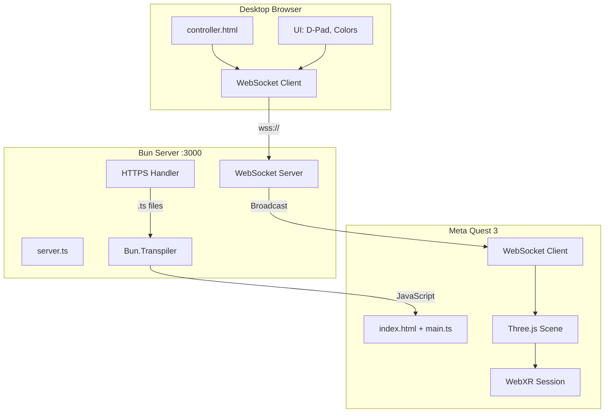
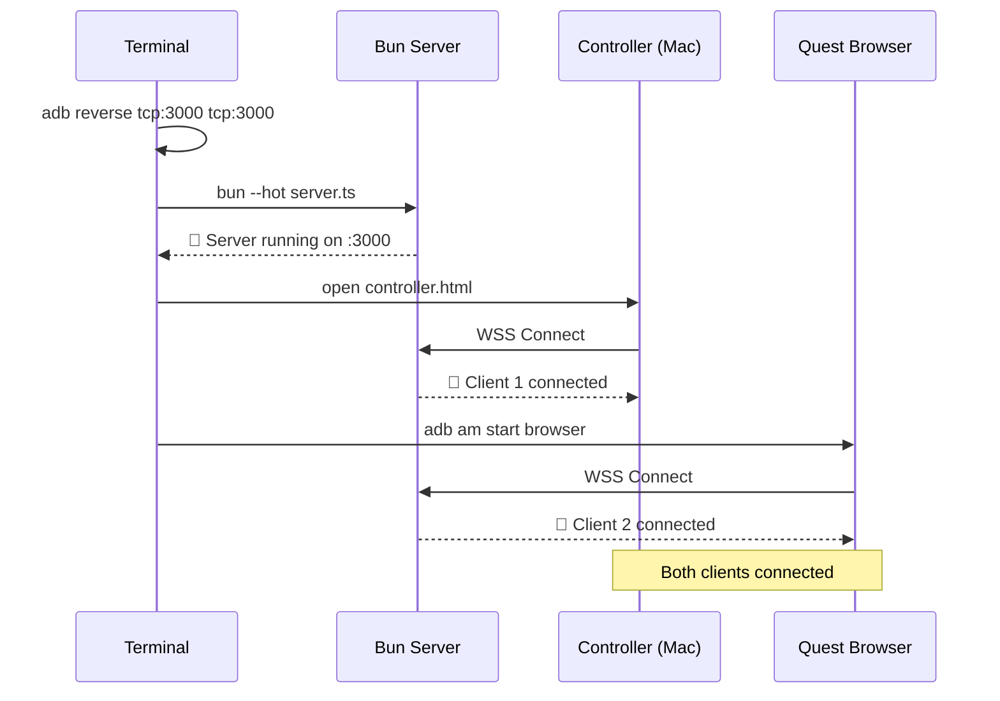
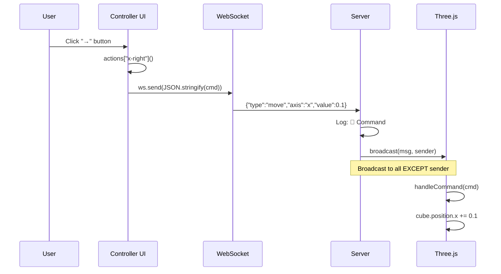
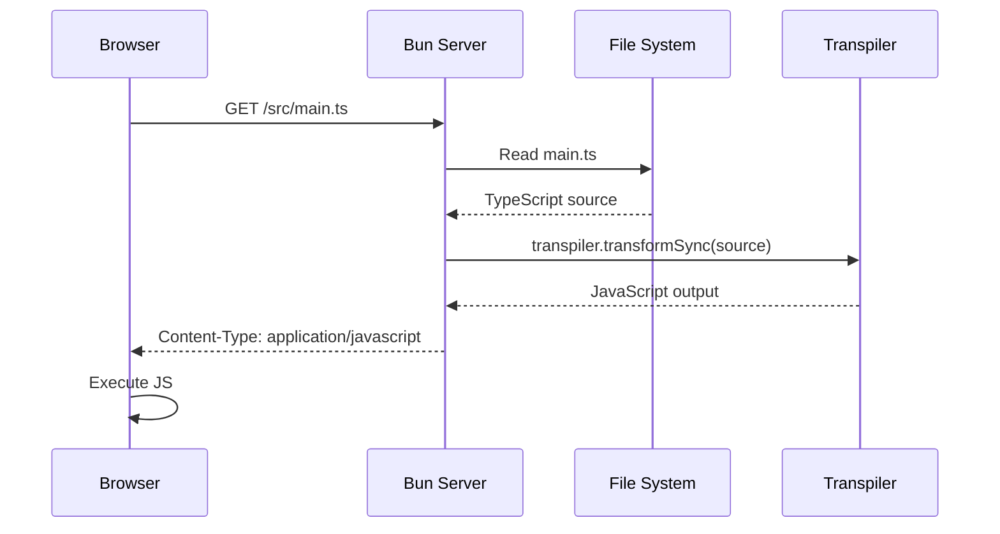
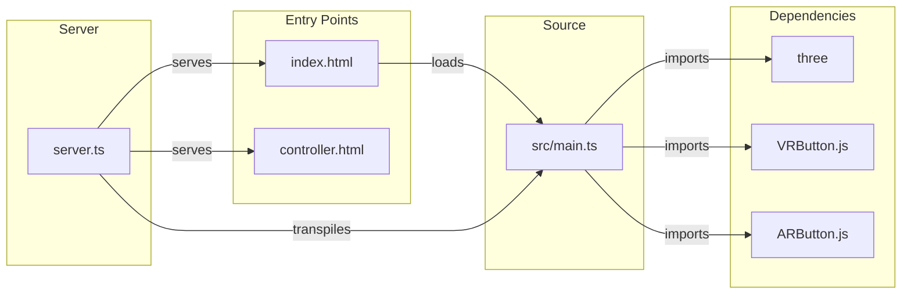

# Architecture Reference

Technical deep-dive into the WebXR Starter Template architecture.

---

## System Overview



---

## Data Flow

### 1. Connection Sequence



### 2. Command Flow



### 3. TypeScript Transpilation



---

## Component Details

### server.ts

```
┌─────────────────────────────────────────────────────────────┐
│ server.ts                                                   │
├─────────────────────────────────────────────────────────────┤
│                                                             │
│  ┌─────────────────┐  ┌─────────────────┐                  │
│  │ MIME_TYPES      │  │ Bun.Transpiler  │                  │
│  │ .html → text    │  │ .ts → .js       │                  │
│  │ .ts → js        │  │                 │                  │
│  └─────────────────┘  └─────────────────┘                  │
│                                                             │
│  ┌─────────────────────────────────────────────────────┐   │
│  │ Bun.serve()                                         │   │
│  │ ┌───────────────┐  ┌────────────────────────────┐   │   │
│  │ │ TLS Config    │  │ fetch() Handler            │   │   │
│  │ │ • key.pem     │  │ • WebSocket upgrade        │   │   │
│  │ │ • cert.pem    │  │ • Static file serving      │   │   │
│  │ └───────────────┘  │ • TS transpilation         │   │   │
│  │                    └────────────────────────────┘   │   │
│  │ ┌────────────────────────────────────────────────┐  │   │
│  │ │ websocket: { open, close, message }            │  │   │
│  │ │ • Track clients in Set<WebSocket>              │  │   │
│  │ │ • Broadcast to all except sender               │  │   │
│  │ └────────────────────────────────────────────────┘  │   │
│  └─────────────────────────────────────────────────────┘   │
│                                                             │
│  ┌─────────────────────────────────────────────────────┐   │
│  │ broadcast(data, sender?)                            │   │
│  │ • Iterate all clients                               │   │
│  │ • Skip sender (prevents echo)                       │   │
│  │ • Send JSON string                                  │   │
│  └─────────────────────────────────────────────────────┘   │
│                                                             │
└─────────────────────────────────────────────────────────────┘
```

### src/main.ts

```
┌─────────────────────────────────────────────────────────────┐
│ src/main.ts                                                 │
├─────────────────────────────────────────────────────────────┤
│                                                             │
│  ┌─────────────────┐  ┌─────────────────┐                  │
│  │ Mode Detection  │  │ Scene Setup     │                  │
│  │ ?mode=vr|ar     │  │ • Camera        │                  │
│  │                 │  │ • Renderer      │                  │
│  └─────────────────┘  │ • Lighting      │                  │
│                       │ • Cube mesh     │                  │
│                       └─────────────────┘                  │
│                                                             │
│  ┌─────────────────────────────────────────────────────┐   │
│  │ WebXR Setup                                         │   │
│  │ • renderer.xr.enabled = true                        │   │
│  │ • VRButton.createButton() or ARButton              │   │
│  │ • renderer.setAnimationLoop()                       │   │
│  └─────────────────────────────────────────────────────┘   │
│                                                             │
│  ┌─────────────────────────────────────────────────────┐   │
│  │ Command Handler                                     │   │
│  │ ┌───────────────┐  ┌───────────────┐               │   │
│  │ │ MoveCommand   │  │ ColorCommand  │               │   │
│  │ │ axis: x|y|z   │  │ color: r|g|b  │               │   │
│  │ │ value: number │  │               │               │   │
│  │ └───────────────┘  └───────────────┘               │   │
│  │                                                     │   │
│  │ handleCommand(cmd) → cube.position / material.color │   │
│  └─────────────────────────────────────────────────────┘   │
│                                                             │
│  ┌─────────────────────────────────────────────────────┐   │
│  │ WebSocket Client                                    │   │
│  │ • Connect to wss://${location.host}                 │   │
│  │ • onmessage → JSON.parse → handleCommand            │   │
│  │ • Status indicator (Connected/Disconnected)         │   │
│  └─────────────────────────────────────────────────────┘   │
│                                                             │
└─────────────────────────────────────────────────────────────┘
```

### controller.html

```
┌─────────────────────────────────────────────────────────────┐
│ controller.html                                             │
├─────────────────────────────────────────────────────────────┤
│                                                             │
│  ┌─────────────────────────────────────────────────────┐   │
│  │ UI Layout                                           │   │
│  │ ┌─────────────────────────────────────────────────┐ │   │
│  │ │ 🟢 Connected              [VR] [AR]             │ │   │
│  │ ├─────────────────────────────────────────────────┤ │   │
│  │ │              [  W  ]                            │ │   │
│  │ │         [←]  [  ↑  ]  [→]                      │ │   │
│  │ │              [  ↓  ]                            │ │   │
│  │ │              [  S  ]                            │ │   │
│  │ ├─────────────────────────────────────────────────┤ │   │
│  │ │      [🔴 R]   [🟢 G]   [🔵 B]                   │ │   │
│  │ └─────────────────────────────────────────────────┘ │   │
│  └─────────────────────────────────────────────────────┘   │
│                                                             │
│  ┌─────────────────────────────────────────────────────┐   │
│  │ Event Handlers                                      │   │
│  │ • mousedown/mouseup → visual feedback               │   │
│  │ • touchstart/touchend → mobile support              │   │
│  │ • keydown → keyboard shortcuts                      │   │
│  └─────────────────────────────────────────────────────┘   │
│                                                             │
│  ┌─────────────────────────────────────────────────────┐   │
│  │ Action Map                                          │   │
│  │ z-forward  → { type: "move", axis: "z", value: -0.1}│   │
│  │ z-backward → { type: "move", axis: "z", value: 0.1} │   │
│  │ x-left     → { type: "move", axis: "x", value: -0.1}│   │
│  │ x-right    → { type: "move", axis: "x", value: 0.1} │   │
│  │ y-up       → { type: "move", axis: "y", value: 0.1} │   │
│  │ y-down     → { type: "move", axis: "y", value: -0.1}│   │
│  │ color-*    → { type: "color", color: "*" }          │   │
│  └─────────────────────────────────────────────────────┘   │
│                                                             │
└─────────────────────────────────────────────────────────────┘
```

---

## WebSocket Protocol

### Message Types

```typescript
// Movement command - adjusts cube position
interface MoveCommand {
  type: "move";
  axis: "x" | "y" | "z";
  value: number;  // Typically ±0.1
}

// Color command - changes cube material color
interface ColorCommand {
  type: "color";
  color: "red" | "green" | "blue";
}

// Union type for all commands
type Command = MoveCommand | ColorCommand;
```

### Color Mapping

```typescript
const COLOR_MAP: Record<string, number> = {
  red:   0xff0000,
  green: 0x00ff00,
  blue:  0x0000ff,
};
```

### Broadcast Pattern

The server implements a **broadcast-to-others** pattern:

```typescript
function broadcast(data: string, sender?: ServerWebSocket): void {
  for (const client of clients) {
    if (client !== sender) {  // Skip sender
      client.send(data);
    }
  }
}
```

This prevents:
- Echo loops (sender receiving their own message)
- Duplicate processing on the controller

---

## Critical Implementation Details

### 1. HTTPS Requirement

WebXR API requires secure context:
- `https://` in production
- `localhost` works without HTTPS in development

```typescript
Bun.serve({
  tls: {
    key: Bun.file("localhost-key.pem"),
    cert: Bun.file("localhost.pem"),
  },
  // ...
});
```

Generate certificates with mkcert:
```bash
bunx mkcert localhost
```

### 2. TypeScript Transpilation

Browsers cannot execute TypeScript. The server transpiles on-the-fly:

```typescript
const transpiler = new Bun.Transpiler({ loader: "ts" });

if (path.endsWith(".ts")) {
  const source = await file.text();
  const js = transpiler.transformSync(source);
  return new Response(js, {
    headers: { "Content-Type": "application/javascript" },
  });
}
```

### 3. WebXR Animation Loop

Must use `setAnimationLoop` instead of `requestAnimationFrame`:

```typescript
// ❌ Wrong - doesn't work with WebXR
function animate() {
  requestAnimationFrame(animate);
  renderer.render(scene, camera);
}

// ✅ Correct - WebXR compatible
renderer.setAnimationLoop(() => {
  renderer.render(scene, camera);
});
```

### 4. AR Mode Configuration

AR requires transparent renderer and no background:

```typescript
// Renderer with alpha
const renderer = new THREE.WebGLRenderer({
  antialias: true,
  alpha: mode === "ar",  // Enable transparency
});

// No scene background for AR
if (mode !== "ar") {
  scene.background = new THREE.Color(0x1a1a2e);
}

// Position cube at chest height for AR
cube.position.set(0, mode === "ar" ? 1.0 : 0, -2);
```

---

## File Dependencies



---

## Port Configuration

| Port | Protocol | Purpose |
|------|----------|---------|
| 3000 | HTTPS | Web server |
| 3000 | WSS | WebSocket server |

ADB port forwarding:
```bash
adb reverse tcp:3000 tcp:3000
```

This maps Quest's `localhost:3000` to Mac's `localhost:3000`.
