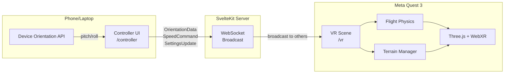
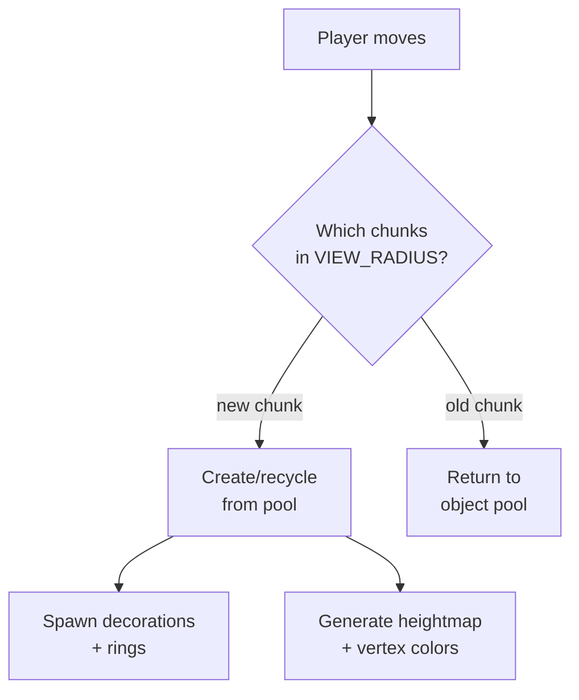

# 🏗️ Architecture

System design for the ICAROS VR Flight Sim.

---

## System Overview



## Data Flow

```
ICAROS Device
    ↓ body lean (pitch + roll)
Phone (Device Orientation API)
    ↓ OrientationData @ 60Hz
Controller UI (/controller)
    ↓ WebSocket (WSS)
SvelteKit Server (hooks.server.ts)
    ↓ broadcast to all except sender
VR Scene (/vr on Quest)
    ↓ FlightPlayer.updateOrientation()
Three.js Render Loop @ 72fps
```

## Module Architecture

### Routes

| Route | Responsibility |
|-------|---------------|
| `/vr` | WebXR canvas, Three.js scene, animation loop, ring scoring |
| `/controller` | D-Pad input, speed buttons, 3D preview, settings sidebar |

### `lib/three/` — 3D Engine

```
scene.ts ─── Scene factory (lights, fog)
player.ts ── FlightPlayer (rig + camera + arcade physics)
sky.ts ───── Low-poly sky dome (vertex-color gradient)
clouds.ts ── Procedural cloud groups (drift animation)
rings.ts ─── Per-chunk collectible rings
loader.ts ── GLTF loader wrapper

terrain/
├── manager.ts ──── Chunk load/unload + object pooling
├── chunk.ts ────── Single 128×128 terrain tile
├── geometry.ts ─── Heightmap → BufferGeometry
├── heightmap.ts ── Simplex noise FBM (5 octaves)
├── water.ts ────── Flat water plane
└── decorations.ts  InstancedMesh trees + rocks
```

### `lib/ws/` — WebSocket

```
client.svelte.ts ── Reactive client (Svelte 5 $state, auto-reconnect)
server.ts ───────── Broadcast-to-others handler
protocol.ts ─────── Serialization + type guard validation
```

### `lib/config/` — Config-Driven Design

All tuning values live in `flight.ts` — a single file with `as const` objects. Modules import what they need, never hardcode values.

**Runtime config**: A mutable copy of defaults can be changed live via `SettingsUpdate` WebSocket messages from the controller sidebar. This enables real-time tuning without code changes.

### `lib/components/` — Svelte UI

```
ControlPad.svelte ──── D-Pad for pitch/roll
SpeedButtons.svelte ── Accelerate/Brake
IcarosPreview.svelte ─ 3D model preview (reactive to input)
SettingsSidebar.svelte  Runtime config sliders/switches
```

## Terrain Chunk System



- **Chunk size**: 128×128 units, 32 segments (visible facets)
- **View radius**: 2 chunks in each direction
- **Object pool**: max 30 recycled chunks (prevents GC pressure)
- **Seeded random**: chunk coordinates → deterministic placement
- **Per-chunk data**: terrain mesh + InstancedMesh trees/rocks + torus rings

## WebSocket Protocol

```typescript
// Controller → VR (60Hz)
{ type: "orientation", pitch: number, roll: number, timestamp: number }

// Controller → VR (on press/release)
{ type: "speed", action: "accelerate" | "brake", active: boolean, timestamp: number }

// Controller → VR (settings change)
{ type: "settings", settings: Record<string, number | boolean | string>, timestamp: number }
```

Server broadcasts each message to all connected clients except the sender.

## Performance Budget (Quest 72fps)

| Metric | Budget | Current |
|--------|--------|---------|
| Draw calls | < 100 | ~8 |
| Triangles | < 500k | ~200k |
| JS frame time | < 11ms | ~4ms |
| VRAM | < 256MB | ~40MB |

### Optimizations

- **InstancedMesh** for trees + rocks (2 draw calls per chunk)
- **Chunked terrain** with load/unload based on distance
- **Object pooling** for chunk recycling
- **Frustum culling** (Three.js default)
- **Fog** hides far terrain (100–500 range)
- **FlatShading** reduces normal computation
