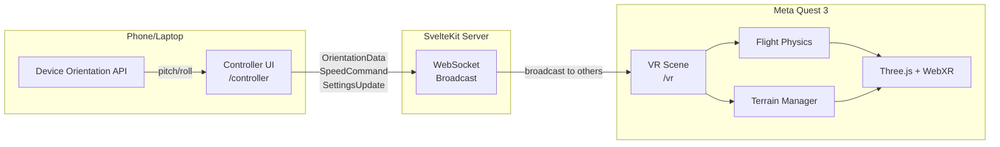
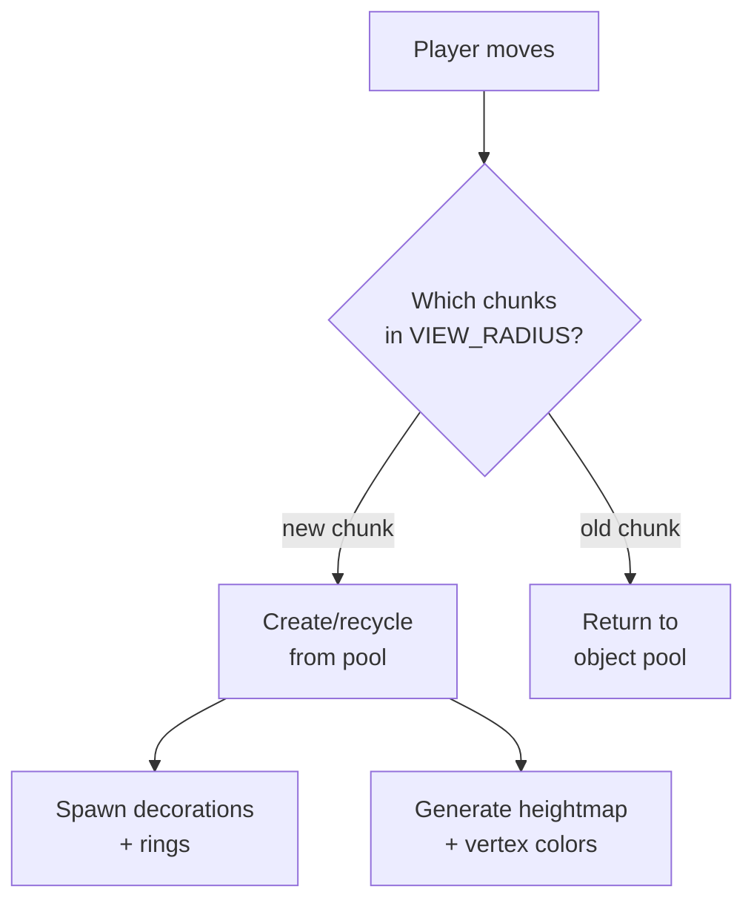

# 🏗️ Architecture

System design for the ICAROS VR Teaching Platform.

---

## System Overview


```mermaid
graph LR
    subgraph Phone/Laptop
        C[Controller UI<br>/controller]
        DOA[Device Orientation API]
    end

    subgraph SvelteKit Server
        WS[WebSocket<br>Broadcast]
    end

    subgraph Meta Quest 3
        VR[VR Scene<br>/vr]
        PHY[Flight Physics]
        TER[Terrain Manager]
        THREE[Three.js + WebXR]
    end

    DOA -->|pitch/roll| C
    C -->|OrientationData<br>SpeedCommand<br>SettingsUpdate| WS
    WS -->|broadcast to others| VR
    VR --> PHY --> THREE
    VR --> TER --> THREE
```

## Three Layers

```
┌─────────────────────────────────────────────────┐
│  Experiences (student-built VR worlds)          │
│  Manifest → Catalog → Loader lifecycle          │
├─────────────────────────────────────────────────┤
│  Prototyping Tools                              │
│  Node Editor + Shader Playground                │
├─────────────────────────────────────────────────┤
│  Infrastructure                                 │
│  WebXR, WebSocket, Controllers, SvelteKit       │
└─────────────────────────────────────────────────┘
```

## Data Flow

```
ICAROS Device
    ↓ body lean (pitch + roll)
Phone (Device Orientation API)
    ↓ OrientationData @ 60Hz
Controller UI (/controller)
    ↓ WebSocket (WSS)
SvelteKit Server (hooks.server.ts)
    ↓ broadcast to all except sender
VR Scene (/vr on Quest)
    ↓ Experience.tick()
Three.js Render Loop @ 72fps
```

## Module Architecture

### Routes

| Route | Responsibility |
|-------|---------------|
| `/` | Experience Catalog — select a VR world |
| `/vr` | WebXR canvas, loads active experience, animation loop |
| `/controller` | D-Pad input, speed buttons, 3D preview, settings sidebar |
| `/node-editor` | Visual node editor — modular signal pipeline for VR parameter control |
| `/shader-playground` | Live TSL shader editor with signal-based modules and 3D preview |
| `/worlds` | Generative world builder — presets for terrain, climate, water, biomes, and vegetation |

### `lib/experiences/` — Experience System

Each experience is a self-contained VR world with 5 files:

```
manifest.ts  ── Declarative I/O contract (parameters, scene config)
scene.ts ────── 3D objects + animation (setup, tick, dispose)
player.ts ───── Orientation → movement mapping
settings.ts ─── Parameter ID → scene mutation
index.ts ────── Re-export entry point
```

- **Catalog** registers all experiences (students add 1 import + 1 line)
- **Loader** manages lifecycle: load → tick → dispose
- **Manifest** defines parameters that appear in Settings Sidebar + Node Editor

### `lib/three/` — Shared 3D Building Blocks

```
scene.ts ─── Scene factory (lights, fog)
player.ts ── FlightPlayer (rig + camera + arcade physics)
sky.ts ───── Low-poly sky dome (vertex-color gradient)
clouds.ts ── Procedural cloud groups (drift animation)
rings.ts ─── Per-chunk collectible rings
loader.ts ── GLTF loader wrapper

terrain/
├── manager.ts ──── Chunk load/unload + object pooling
├── chunk.ts ────── Single 128×128 terrain tile
├── geometry.ts ─── Heightmap → BufferGeometry
├── heightmap.ts ── Simplex noise FBM (5 octaves)
├── water.ts ────── Flat water plane
└── decorations.ts  InstancedMesh trees + rocks
```

### `lib/ws/` — WebSocket

```
client.svelte.ts ── Reactive client (Svelte 5 $state, auto-reconnect)
server.ts ───────── Broadcast-to-others handler
protocol.ts ─────── Serialization + type guard validation
```

### `lib/config/` — Config-Driven Design

All tuning values live in `flight.ts` — a single file with `as const` objects. Modules import what they need, never hardcode values.

**Runtime config**: A mutable copy of defaults can be changed live via `SettingsUpdate` WebSocket messages from the controller sidebar. This enables real-time tuning without code changes.

### `lib/node-editor/` — Visual Node Editor

Modular signal system (Eurorack architecture). See [`src/lib/node-editor/README.md`](../src/lib/node-editor/README.md) for full details.

```
components/   Atomic signal processors (12 Logic + 11 UI)
nodes/        Node compositions (9 standard + 8 auto-generated output)
canvas/       SvelteFlow infrastructure (EditorCanvas, NodeShell, Catalog)
controls/     UI primitives (bits-ui based, signal-unaware)
graph/        Headless compute engine (SignalGraph, evaluate)
parameters/   VR parameter registry (dynamic from manifest)
bridge.ts     WebSocket → Three.js (numbers only)
```

### `lib/shader-playground/` — Shader Playground

Signal-based TSL shader editor with 3D preview. See [`src/lib/shader-playground/README.md`](../src/lib/shader-playground/README.md) for full details.

```
modules/      24 shader modules (4 control + 10 vertex + 10 fragment)
components/   Rack UI, Preview, CodeView
engine/       TSL renderer + Three.js integration
codegen.ts    Module chain → TSL node composition
state.svelte.ts  Reactive state (Svelte 5 Runes)
```

Pipeline: `Module[] → codegen → TSL nodes → renderer → 3D Preview`

### `lib/components/` — Svelte UI

```
ControlPad.svelte ──────── D-Pad for pitch/roll
SpeedButtons.svelte ────── Accelerate/Brake
IcarosPreview.svelte ───── 3D model preview (reactive to input)
SettingsSidebar.svelte ─── Runtime config sliders/switches
PageHeader.svelte ──────── Page title + subtitle
LinkCard.svelte ────────── Navigation card with icon
DataTable.svelte ───────── Key-value data display
ArchitectureDiagram.svelte  ASCII architecture diagram
NodeEditorPreview.svelte ── Node editor preview card
```

## Terrain Chunk System


```mermaid
graph TD
    PM[Player moves] --> TC{Which chunks<br>in VIEW_RADIUS?}
    TC -->|new chunk| LOAD[Create/recycle<br>from pool]
    TC -->|old chunk| UNLOAD[Return to<br>object pool]
    LOAD --> DECO[Spawn decorations<br>+ rings]
    LOAD --> GEO[Generate heightmap<br>+ vertex colors]
```

- **Chunk size**: 128×128 units, 32 segments (visible facets)
- **View radius**: 2 chunks in each direction
- **Object pool**: max 30 recycled chunks (prevents GC pressure)
- **Seeded random**: chunk coordinates → deterministic placement
- **Per-chunk data**: terrain mesh + InstancedMesh trees/rocks + torus rings

## WebSocket Protocol

```typescript
// Controller → VR (60Hz)
{ type: "orientation", pitch: number, roll: number, timestamp: number }

// Controller → VR (on press/release)
{ type: "speed", action: "accelerate" | "brake", active: boolean, timestamp: number }

// Controller → VR (settings change)
{ type: "settings", settings: Record<string, number | boolean | string>, timestamp: number }
```

Server broadcasts each message to all connected clients except the sender.

## Performance Budget (Quest 72fps)

| Metric | Budget | Current |
|--------|--------|---------|
| Draw calls | < 100 | ~8 |
| Triangles | < 500k | ~200k |
| JS frame time | < 11ms | ~4ms |
| VRAM | < 256MB | ~40MB |

### Optimizations

- **InstancedMesh** for trees + rocks (2 draw calls per chunk)
- **Chunked terrain** with load/unload based on distance
- **Object pooling** for chunk recycling
- **Frustum culling** (Three.js default)
- **Fog** hides far terrain (100–500 range)
- **FlatShading** reduces normal computation

## Generative World Builder Plan

Status: first vertical slice implemented. The current codebase already has two useful starting points:

- `src/lib/experiences/sinneswandler_test1/` contains the most advanced world logic today: biome sampling, derived fields, vegetation placement, perception modes, acoustic fields, and a worker-backed terrain pipeline.
- `src/lib/three/world/` contains reusable pieces that should become the shared worldgen runtime: `NoiseStack`, `TerrainDataBuilder`, `ChunkScheduler`, `WorldgenWorkerPool`, acoustic probes, sample caches, and chunk geometry helpers.

The goal is to extract the reusable parts from `sinneswandler_test1` into a generic world module, then let any experience select or embed a configured generated world.

### Product Goal

The platform should get a dedicated route menu for creating and assigning generated worlds:

```
/worlds
    create/edit world preset
    tune terrain, climate, water, biome, and vegetation parameters
    preview generated world layers in a renderer-neutral viewport
    save preset locally
    assign preset to an experience

/vr
    load selected experience
    load selected world preset
    pass generated WorldRuntime into the experience setup
```

This should make worlds configurable without editing TypeScript files. Students should be able to start with presets such as wetland, alpine forest, fungal valley, dry steppe, or river basin and then change them through sliders or nodes.

Perception settings do not belong in the world preset. Echolocation, infrared, chemical perception, and swarm/network modes are experience/rendering concerns. A world may expose physical data such as height, temperature, moisture, water, flow, and vegetation; an experience decides how a sense interprets that data.

The `/worlds` canvas is only a finite preview window. Runtime sampling is region-based: `WorldRuntime.sample(x, z)` resolves arbitrary coordinates by generating deterministic hydrology regions on demand, so experiences can fly indefinitely while the generator remains the owner of terrain, biome, water, and vegetation data. Region cells are sampled with bilinear interpolation for height, climate, water, flow, and vegetation; nearest-cell sampling is not acceptable because it creates square islands, blocky biome sections, and unnatural water edges.

### Renderer And WebGPU Compatibility

`sinneswandler_test1` is being migrated toward WebGPU in parallel. The generative world module must stay compatible with that migration.

World generation is therefore a renderer-neutral data module:

- `src/lib/worldgen/*` must not import `three`, `WebGLRenderer`, `WebGPURenderer`, WebXR renderer state, materials, geometries, or shader objects.
- `WorldRuntime` owns deterministic sampling, region caching, hydrology, biome, water, and vegetation data only.
- Experiences and renderer adapters decide how those layers become visible terrain, water, vegetation, particles, or sense-specific effects.
- WebGL and WebGPU consumers should both read the same world contract: height, normalized height, biome, water depth, river/lake flags, flow, temperature, moisture, rainfall, slope, and vegetation density.
- GPU-friendly exports are plain typed arrays / texture-ready layer buffers, not renderer objects.
- Experience adapters must preserve generated world data. They may translate it into local biome/material fields, but they must not discard `waterDepth`, `flow`, `riverWidth`, `channelDepth`, `isRiver`, `isLake`, or the source `worldBiome`.
- Vegetation placement is world data. Trees, rocks, grass, plants, and prop instance transforms are generated in `src/lib/worldgen/vegetation`.
- Three.js model loading and `InstancedMesh` assembly are renderer adapter concerns. Shared Three vegetation assets live in `src/lib/three/world/vegetation`; Sinneswandler should only consume them.

Target adapter boundary:

```text
WorldPreset
    -> WorldRuntime / buildWorldMap
    -> WorldLayerBuffers
        height: Float32Array
        normalizedHeight: Float32Array
        temperature/moisture/rainfall: Float32Array
        biome: Uint8Array
        waterDepth: Float32Array
        flow: Float32Array
        riverWidth/channelDepth: Float32Array
        flags: Uint8Array
        vegetationDensity: Float32Array
    -> WebGL adapter OR WebGPU adapter OR 2D editor preview
```

This keeps the world builder usable while Sinneswandler moves renderer technology. WebGPU may later use the same data for storage buffers, compute passes, heightmap textures, water masks, flow maps, and GPU-driven instancing without rewriting world rules.

### Core Data Model

World generation must be data-first, not mesh-first. A terrain mesh is only one render output of the world state.

```typescript
export interface WorldPreset {
	id: string;
	name: string;
	version: string;
	seed: number;
	terrain: TerrainGenerationConfig;
	climate: ClimateConfig;
	hydrology: HydrologyConfig;
	biomes: BiomeRuleSet;
	vegetation: VegetationRuleSet;
	streaming: WorldStreamingConfig;
}

export interface WorldSample {
	x: number;
	z: number;
	height: number;
	slope: number;
	temperature: number;
	moisture: number;
	rainfall: number;
	waterDepth: number;
	flow: number;
	biome: string;
	vegetationDensity: number;
}
```

The important generated layers are:

| Layer | Purpose |
|-------|---------|
| Height | Base terrain elevation, ridges, valleys, cliffs |
| Temperature | Biome selection and physical warmth/cooling data |
| Moisture | Forests, wetlands, moss, fungal zones |
| Rainfall | River source probability and biome transitions |
| Water | Rivers, lakes, wetlands, shorelines |
| Flow | River strength and erosion-like valley shaping |
| Biome | Material, color, vegetation, and ecology defaults |
| Vegetation | Object placement masks and density fields |

### Hydrology Requirement

The world builder should support real river paths and lakes, not just blue noise stripes.

Minimum viable hydrology:

1. Generate base height with continent, ridge, basin, and detail noise.
2. Generate rainfall/moisture fields.
3. Find lowland basins that can become lakes or wetlands.
4. Pick river sources from high-elevation, high-rainfall cells.
5. Route rivers toward basin/lake targets or existing larger rivers, not toward preview borders.
6. Accumulate flow as tributaries join larger rivers.
7. Let large lakes either terminate a river or later spill into another downstream basin.
8. Carve a lightweight visual channel from flow values.
9. Render rivers as smoothed curve bands or narrow mesh strips.
10. Render lakes as flat or slightly animated water meshes clipped to basin cells.

This is the main algorithmic upgrade over the current `sinneswandler_test1` style terrain. `sinneswandler_test1` already proves biome-rich terrain and experience-specific sense modes; hydrology should become the next shared world runtime layer.

Reference rule: borrow Mapgen4's separation of elevation, rainfall, downstream routing, and flow accumulation, but do not use the finite preview border as the hydrology outlet. In an infinite world, a river may end in a large lake/wetland basin, join a larger river, or continue into another generated region through an explicit region connection.

### UI And Node Control

The route `/worlds` should provide two editing modes:

| Mode | User |
|------|------|
| Regler | Fast tuning with sliders, toggles, dropdowns, and color controls |
| Nodes | Advanced modulation and relationships between generated layers |

Slider groups:

- Terrain: seed, height scale, continent scale, ridge strength, basin depth, detail amplitude, cliff threshold.
- Climate: temperature bias, moisture bias, rainfall amount, wind direction, altitude cooling.
- Hydrology: water level, river source count, flow threshold, lake threshold, channel carve strength, river width.
- Biomes: biome weights, transition softness, height/moisture/temperature thresholds.
- Vegetation: density, clustering, clearing amount, tree/bush/rock ratios, biome-specific spawn masks.
- Streaming: chunk size, build radius, keep radius, max builds per frame, worker count.

Node controls should reuse the existing `src/lib/node-editor/` architecture. Instead of only driving experience parameters, generated output nodes should be able to drive world preset parameters:

```
LFO / Noise / Slider / Mixer
    -> terrain.heightScale
    -> climate.moistureBias
    -> hydrology.riverWidth
    -> biomes.forest.weight
    -> vegetation.density
```

Runtime rule: node outputs may change high-level world parameters live, but expensive changes must invalidate chunks gradually through the `ChunkScheduler` and worker pool instead of rebuilding the whole world in one frame.

### Experience Integration

Experiences should declare whether they accept generated worlds.

```typescript
export interface ExperienceManifest {
	// existing fields...
	world?: {
		supported: boolean;
		defaultPresetId?: string;
		requiredLayers?: Array<
			| "height"
			| "biome"
			| "water"
			| "vegetation"
			| "echolocation"
			| "infrared"
			| "chemical"
			| "swarm"
		>;
	};
}
```

The loader should resolve:

```text
selected experience
    + selected world preset
    -> setup context gets WorldRuntime
```

This keeps existing experiences working while allowing world-aware experiences to opt in.

Important ownership rule: generated worlds are not Sinneswandler settings. `/worlds` owns the full `WorldPreset` and `WorldRuntime`; Sinneswandler, future ICAROS experiences, WebGL renderers, and WebGPU renderers consume the same runtime contract through samples or layer buffers.

### Proposed Module Layout

```
src/lib/worldgen/
├── types.ts                 WorldPreset, WorldSample, layer contracts
├── presets.ts               Built-in presets and default values
├── storage.ts               localStorage persistence for selected world preset
├── layers.ts                typed-array layer export for CPU/WebGL/WebGPU consumers
├── runtime.ts               deterministic region cache + sampling API
├── sampler.ts               height, climate, biome, hydrology, lake/river map build
├── random.ts                deterministic random helpers
├── noise/
│   ├── NoiseStack.ts        migrate from lib/three/world
│   └── recipes.ts           terrain/climate noise recipes
├── terrain/
│   ├── height-sampler.ts    generic version of sinneswandler height sampler
│   ├── biome-sampler.ts     generic biome rule evaluation
│   └── sample-cache.ts      reusable coordinate sample cache
├── hydrology/
│   ├── river-sources.ts     source selection from height + rainfall
│   ├── flow-tracer.ts       downhill routing and flow accumulation
│   ├── lakes.ts             basin fill and spill logic
│   └── channels.ts          river/lake masks for terrain and mesh output
├── vegetation/
│   ├── decoration-data.ts   deterministic object placement typed arrays
│   ├── rules.ts             biome-specific object rules
│   └── placement.ts         future split from decoration-data
└── worker/
    ├── protocol.ts          future plain serializable messages
    ├── worldgen.worker.ts   future off-main world-only generation
    └── invalidation.ts      future chunk/region invalidation helpers

src/lib/three/world/
├── adapters/
│   ├── TerrainMeshBuilder.ts      WebGL/Three terrain output
│   ├── WaterMeshBuilder.ts        WebGL/Three water output
│   └── DecorationMeshBuilder.ts   WebGL/Three decoration output
├── vegetation/
│   └── world-models.ts            shared Three geometry/model loading for trees, rocks, plants
└── worker/
    ├── worldgen.worker.ts         current Sinneswandler chunk worker bridge
    ├── protocol.ts
    └── WorldgenWorkerPool.ts

src/lib/webgpu/world/
├── adapters/
│   ├── terrain-pipeline.ts        WebGPU terrain buffers/pipeline
│   ├── water-pipeline.ts          WebGPU water masks/flow rendering
│   └── vegetation-pipeline.ts     WebGPU instancing buffers

src/routes/worlds/
├── +page.svelte             editor route
├── components/
│   ├── WorldPreview.svelte
│   ├── WorldPresetList.svelte
│   ├── TerrainPanel.svelte
│   ├── ClimatePanel.svelte
│   ├── HydrologyPanel.svelte
│   ├── BiomePanel.svelte
│   └── VegetationPanel.svelte
└── world-editor.css
```

### Open Source References To Use

These are the most useful repos from the research document:

| Priority | Repo | Use |
|----------|------|-----|
| 1 | Red Blob Games Mapgen4 | Main reference for rainfall, moisture, rivers, drainage, and data-layer architecture |
| 2 | Red Blob terrain articles / mapgen2 | Clear algorithms for height, moisture, biome rules, rivers, and Voronoi regions |
| 3 | FastNoise Lite | Recommended noise API if `simplex-noise` becomes too limited; useful for domain warp, cellular, and richer fractal noise |
| 4 | THREE.Terrain | Reference for Three.js terrain mesh generation, height filters, material blending, and fast prototype behavior |
| 5 | SimpleHydrology | Reference for stream, pool, and flow thinking; useful for the river/lake layer design |
| 6 | Wave Function Collapse JS port | Later detail pass for local object patterns: ruins, plant clusters, rocks, cave tiles |
| 7 | Terrain3D | Performance reference for future clipmap/LOD terrain, not a direct dependency |
| 8 | WorldEngine | Offline/reference source for climate and biome ideas, not runtime code |
| 9 | ProceduralTerrain | Pipeline reference for feature curves, erosion, vegetation, and biome order |
| 10 | WorldSynth | Conceptual reference for graph-like terrain layers and data-driven generation |

The first implementation should not import a full external world engine. It should build a small TypeScript runtime around the existing `NoiseStack`, worker pool, chunk scheduler, and `sinneswandler_test1` samplers, then selectively port algorithms from Red Blob and SimpleHydrology.

### Implementation Phases

| Phase | Status | Scope |
|-------|--------|-------|
| 0 | Existing | `sinneswandler_test1` has rich biomes, vegetation, perception layers, and worker-backed chunk building |
| 1 | Implemented | Add `/worlds` route shell, built-in presets, localStorage selection, and a route card on `/` |
| 2 | Planned | Extract generic world config/types from `sinneswandler_test1` into `src/lib/worldgen` |
| 3 | Partly implemented | Build editor panels for terrain, climate, biome, vegetation, and hydrology sliders |
| 4 | Partly implemented | Add world preview viewport with chunk streaming and deterministic regeneration |
| 5 | Partly implemented | Add hydrology data layer: river sources, downhill flow, flow accumulation, lake basins, water masks |
| 6 | Partly implemented | Render rivers and lakes with generated water meshes; decoration placement now avoids water cells |
| 7 | Implemented | Let experiences opt into `WorldRuntime` through the manifest and loader |
| 8 | Implemented | Add renderer-neutral layer-buffer exports for WebGPU/WebGL adapters |
| 9 | Implemented | Move reusable vegetation placement data into `src/lib/worldgen/vegetation` |
| 10 | Implemented | Move reusable Three vegetation model loading into `src/lib/three/world/vegetation` |
| 11 | Planned | Expose world preset parameters as Node Editor output targets |
| 12 | Planned | Add WFC/detail pattern pass for biome-local object layouts |
| 13 | Planned | Add regression scripts for determinism, chunk invalidation, and hydrology consistency |

### First Vertical Slice

The smallest useful implementation should be:

1. `/worlds` route with preset list and parameter panels.
2. `WorldPreset` type and two presets: `sinneswandler-forest` and `river-basin`.
3. Generic terrain/climate/biome sampler extracted from `sinneswandler_test1`.
4. Preview chunk at the origin with biome colors and vegetation masks.
5. LocalStorage assignment: selected world preset + selected experience.
6. `sinneswandler_test1` converted to consume a preset-backed config without changing its visual result.

After that, hydrology becomes the first major feature: river paths, lakes, and water rendering.

Current water rendering status: `TerrainDataBuilder` exports `waterHeights` and `waterMask` per chunk, `TerrainMeshBuilder` can assemble a separate transparent water mesh, and Sinneswandler attaches/disposes that mesh with each streamed chunk. This uses the generated `waterDepth`, `isRiver`, and `isLake` fields from `WorldRuntime`; the next refinement is a richer water adapter with flow-aware river strips, shoreline blending, and WebGPU-ready flow textures.
