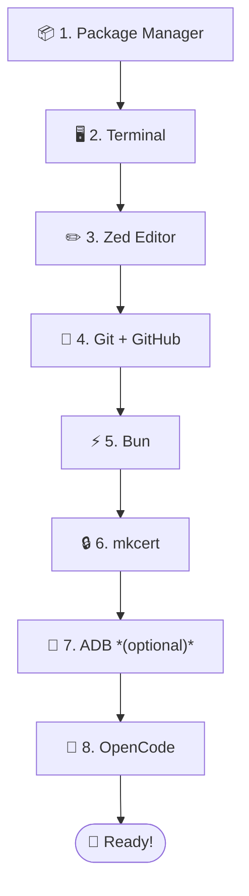

# 🗺️ Starter Kit — Setup Tutorials

> Welcome! This guide takes you from **zero** to a **running VR development environment** — no prior experience required.

## What is this project?

The **ICAROS VR Teaching Platform** lets you build immersive VR worlds for the **Meta Quest 3**, controlled through body movement on an ICAROS fitness device. You'll write code that runs directly in the browser — no app store, no compilation, just save and refresh.

---

## 🧰 What you'll install

| Tool | What it does |
|------|-------------|
| 📦 **Package Manager** | Installs developer tools (like an app store for your terminal) |
| 🖥️ **Terminal** | Your command center — where you type commands |
| ✏️ **Zed** | Code editor — where you write and read code |
| 🔧 **Git + GitHub** | Version control + online collaboration platform |
| ⚡ **Bun** | JavaScript runtime — the engine that runs your code |
| 🔒 **mkcert** | HTTPS certificates — required for VR in the browser |
| 📱 **ADB** | USB bridge to Meta Quest (optional, only if you have a Quest) |
| 🤖 **OpenCode** | AI coding assistant in your terminal |

---

## 🖥️ Choose your operating system

Pick the guide that matches your computer:

| | Guide | Time |
|---|-------|------|
| 🍎 | [**macOS Setup**](macos.md) | ~30 minutes |
| 🪟 | [**Windows Setup**](windows.md) | ~30 minutes |
| 🐧 | [**Linux Setup**](linux.md) | ~30 minutes |

After finishing your OS guide, continue with:

| | Guide | |
|---|-------|-|
| 🚀 | [**First Steps**](first-steps.md) | Clone the project, start the server, explore |
| ⌨️ | [**Terminal Basics**](terminal-basics.md) | Essential commands cheat sheet (navigation, git, files) |
| 🐙 | [**GitHub Basics**](github-basics.md) | Branches, pull requests, and the team workflow |

---

## 📺 Recommended YouTube Videos

Learn visually! These videos cover the same tools you'll install:

### 🔧 Git & GitHub

| Video | Duration | Best for |
|-------|----------|----------|
| [Git and GitHub Course For Beginners](https://www.youtube.com/watch?v=bFHwtm6FQ4c) | 30 min | ⭐ Quick start — basics to Pull Requests |
| [Visualized Git Course](https://www.youtube.com/watch?v=S7XpTAnSDL4) | 1h 12min | Visual learners — branches + PRs as diagrams |
| [Git Tutorial for Beginners](https://www.youtube.com/watch?v=5bVCXWGOJhM) | 40 min | Hands-on project with stash + PRs |

### ✏️ Zed Editor

| Video | Duration | Best for |
|-------|----------|----------|
| [Zed Editor 101 — Ultimate Setup Guide](https://www.youtube.com/watch?v=NAk4tyfIM3A) | 28 min | ⭐ Complete setup — themes, keybindings, AI |
| [Zed Tutorial — How to Code Smarter](https://www.youtube.com/watch?v=6JJxg3iG2nE) | 7 min | Quick overview of AI features |

### ⌨️ Terminal / Command Line

| Video | Duration | Best for |
|-------|----------|----------|
| [Terminal Crash Course — For Absolute Beginners](https://www.youtube.com/watch?v=hREnP0HslK8) | 52 min | ⭐ Everything from navigation to permissions |
| [Command Line Crash Course — Traversy Media](https://www.youtube.com/watch?v=uwAqEzhyjtw) | 45 min | Works on Mac, Linux, AND Windows |

---

## ❓ What if I get stuck?

1. **Re-read the step** — every command has a ✅ verification to check if it worked
2. **Check the ⚠️ troubleshooting** below each step
3. **Ask David** — in class or via email
4. **Open a GitHub Issue** — [github.com/dweigend/simple_flight/issues](https://github.com/dweigend/simple_flight/issues)

---

## 📖 Already set up?

If you already have a development environment and just need the project dependencies (Bun, mkcert, ADB), see [docs/SETUP.md](../docs/SETUP.md).
