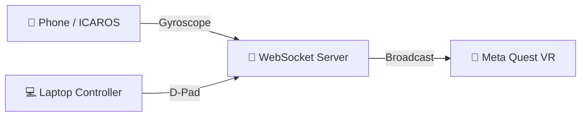

# 🚀 First Steps — Clone, Run, Explore

> Your development environment is set up. Now let's get the project running!

📋 **Prerequisites:** Completed your OS setup guide ([macOS](macos.md) / [Windows](windows.md) / [Linux](linux.md))

---

## How it all connects



Your laptop runs the **server**. Phones, controllers, and VR headsets all connect to it through the browser.

---

## Step 1 — 📂 Clone the repository

"Cloning" means downloading the project code from GitHub to your computer.

Open your terminal (Ghostty / Windows Terminal) and run:

```bash
# Navigate to where you want the project (e.g., your home folder)
cd ~

# Download the project from GitHub
git clone https://github.com/dweigend/neural-flight-template.git

# Go into the project folder
cd neural-flight-template
```

**✅ Verify:** You should see project files:
```bash
ls
```

You should see folders like `src/`, `docs/`, `tutorials/`, and files like `package.json`.

---

## Step 2 — 📦 Install dependencies

The project uses many open-source libraries. This command downloads them all:

```bash
# Install all project dependencies
bun install
```

**✅ Verify:** You should see output ending with something like:
```
+ 150 packages installed
```

A `node_modules/` folder now exists in your project.

> ⚠️ **Errors?** Make sure you're inside the `neural-flight-template` folder (`cd neural-flight-template`) and that Bun is installed (`bun --version`).

---

## Step 3 — 🔒 Generate HTTPS certificates

WebXR (VR in the browser) requires HTTPS. Generate local certificates:

```bash
# Generate certificates for localhost
mkcert localhost
```

**✅ Verify:** Two new files appear in the project root:
```bash
ls localhost*.pem
```

You should see:
```
localhost-key.pem   localhost.pem
```

---

## Step 4 — 🚀 Start the dev server

This is the big moment — let's start the project!

```bash
# Start the development server
bun run dev
```

**✅ Verify:** You should see output like:
```
VITE v5.x.x ready in xxx ms

➜  Local:   https://localhost:5173/
➜  Network: https://192.168.x.x:5173/
```

> 💡 **The server keeps running.** Don't close this terminal window! Open a new tab or window for other commands.

---

## Step 5 — 🌐 Open in browser

Open your browser (Chrome or Edge recommended) and go to:

```
https://localhost:5173
```

**✅ Verify:** You should see the **Experience Catalog** — a page showing available VR worlds.

> ⚠️ **"Your connection is not private" warning?** This is normal for local HTTPS. Click "Advanced" → "Proceed to localhost (unsafe)". The mkcert certificates are safe — the browser just doesn't know them yet.

---

## Step 6 — ✏️ Open in Zed

Open a **new terminal** (keep the dev server running!) and launch Zed:

```bash
# Open the project in Zed (run from the project folder)
cd ~/neural-flight-template
zed .
```

**✅ Verify:** Zed opens with the project file tree on the left.

**Try it:**
1. In the file tree, navigate to `src/routes/+page.svelte` — this is the landing page
2. Press `` Ctrl + ` `` to open Zed's built-in terminal
3. You can run commands here too!

---

## Step 7 — 🤖 Try OpenCode

Open a new terminal (or use Zed's built-in terminal) and start OpenCode:

```bash
# Make sure you're in the project folder
cd ~/neural-flight-template

# Start OpenCode
opencode
```

**Try asking it:**
- "What does this project do?"
- "Explain the WebSocket data flow"
- "What files would I edit to create a new VR experience?"

> 📖 **First time?** OpenCode will ask for an API key. Follow the instructions or see [opencode.ai/docs](https://opencode.ai/docs/).

---

## Step 8 — 🥽 Connect Meta Quest (optional)

If you have a Meta Quest headset, connect it now:

```bash
# 1. Connect Quest via USB-C cable
# 2. Check if the Quest is detected
adb devices
```

You should see your device listed. If the Quest shows a popup asking about USB debugging, tap **"Allow"**.

```bash
# 3. Create a tunnel from Quest to your dev server
adb reverse tcp:5173 tcp:5173
```

Now open **Quest Browser** on the headset and go to:
```
https://localhost:5173/vr
```

Click **"Enter VR"** — you're in!

> 📖 **Detailed Quest setup:** [docs/SETUP.md](../docs/SETUP.md)

---

## Step 9 — 🎮 Try the Controller

Open a **new browser tab** and go to:

```
https://localhost:5173/controller
```

**✅ Verify:** You see a D-Pad and a settings sidebar. If the Quest is connected, the D-Pad controls the VR camera!

---

## Step 10 — 🎨 Explore the Shader Playground

Open a **new browser tab** and go to:

```
https://localhost:5173/shader-playground
```

**✅ Verify:** You see a shader editor with a 3D preview sphere. Try dragging modules into the rack!

---

## 🎉 You're all set!

Here's what you have running:

| URL | What it does |
|-----|-------------|
| `https://localhost:5173` | 🏠 Experience Catalog |
| `https://localhost:5173/vr` | 🥽 VR Scene (open on Quest) |
| `https://localhost:5173/controller` | 🎮 Desktop Controller |
| `https://localhost:5173/shader-playground` | 🎨 Shader Playground |
| `https://localhost:5173/node-editor` | 🔧 Node Editor |

---

## 🔜 What's next?

### 📝 Submit your first change

Now that everything is running, try making a small change and submitting it as a **Pull Request** to David:

1. Create a branch → edit a file → commit → push → PR
2. Full walkthrough: 👉 [**GitHub Basics — Your First Pull Request**](github-basics.md#-your-first-pull-request--walkthrough)

### 🏗️ Build something

- **Build your own VR experience** — use the `new-level` agent skill for guided scaffolding:
  - **OpenCode:** Ask "create a new level" or point to `.agents/skills/new-level/SKILL.md`
  - **Claude Code:** Type `/new_level my-level-name`
  - **Manual:** Copy the template folder — see [`src/lib/experiences/README.md`](../src/lib/experiences/README.md)
- **Learn about shaders** → explore the Shader Playground at `/shader-playground`
- **Wire up parameters** → try the Node Editor at `/node-editor`

### 📚 Reference guides

- [**Terminal Basics**](terminal-basics.md) — essential commands cheat sheet
- [**GitHub Basics**](github-basics.md) — branches, PRs, team workflow

Happy coding! 🚀
