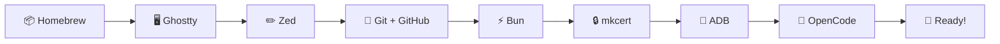

# 🍎 macOS Complete Setup

> From zero to a running development environment on macOS.



⏱️ **Estimated time:** ~30 minutes
📋 **Prerequisites:** macOS 13+ (Ventura or newer), nothing else

---

## ⚠️ macOS Gotchas — Read this first!

> **🔒 Gatekeeper:** The first time you open Homebrew, Ghostty, or Zed, macOS may block them with a popup saying _"App can't be opened because it is from an unidentified developer"_. To fix this:
>
> 1. Open **System Settings** → **Privacy & Security**
> 2. Scroll down — you'll see a message about the blocked app
> 3. Click **"Open Anyway"**
>
> This is normal — macOS is just being cautious with apps downloaded from the internet.

---

## Step 1 — 📦 Homebrew (Package Manager)

Homebrew is like an **app store for developer tools**. Instead of downloading installers from websites, you type one command and Homebrew handles the rest.

Open **Terminal** (press `Cmd + Space`, type "Terminal", press Enter) and paste:

```bash
# Install Homebrew
/bin/bash -c "$(curl -fsSL https://raw.githubusercontent.com/Homebrew/install/HEAD/install.sh)"
```

The installer will ask for your **Mac password** — type it and press Enter. You won't see the characters as you type — that's normal!

**✅ Verify:**
```bash
brew --version
```

You should see something like:
```
Homebrew 4.x.x
```

> ⚠️ **"command not found: brew"?** The installer shows instructions at the end to add Homebrew to your PATH. Look for lines starting with `echo` and `eval` — copy and paste them into your terminal, then try again.

---

## Step 2 — 🖥️ Ghostty (Terminal)

A terminal is your **command center** — it's where you type commands to install tools, run your project, and interact with your code. Ghostty is a modern, fast terminal app.

```bash
# Install Ghostty
brew install --cask ghostty
```

**✅ Verify:** Open Ghostty from your Applications folder (or press `Cmd + Space`, type "Ghostty").

> ⚠️ **Gatekeeper popup?** See the macOS Gotchas section above — go to System Settings → Privacy & Security → "Open Anyway".

From now on, **use Ghostty** for all terminal commands in this guide.

---

## Step 3 — ✏️ Zed (Code Editor)

Zed is where you'll **write and read code**. It's fast, has a built-in terminal, and supports all the languages we use.

```bash
# Install Zed
brew install --cask zed
```

**✅ Verify:** Open Zed from your Applications folder.

**Quick settings (optional):**
- Open Settings: `Cmd + ,`
- Increase font size: look for `"ui_font_size"` and `"buffer_font_size"`
- Change theme: `Cmd + K`, then `Cmd + T`

**💡 Built-in terminal:** Press `` Ctrl + ` `` (control + backtick) to open a terminal inside Zed. You can run commands right where you write code!

---

## Step 4 — 🔧 Git + GitHub (Version Control)

Git is like **save points in a video game** — it tracks every change you make to your code, so you can always go back if something breaks. **GitHub** is the online platform where the team shares code, reviews changes, and collaborates.

### 4a — Install Git

macOS may already have Git via Xcode Command Line Tools. Let's check:

```bash
# Check if Git is already installed
git --version
```

If you see a version number, you're good! If macOS shows a popup asking to install **Xcode Command Line Tools**, click **"Install"** and wait (~5 minutes).

If neither happens:

```bash
# Install Xcode Command Line Tools manually
xcode-select --install
```

**Now configure Git with your name and email:**

```bash
# Set your name (replace with YOUR name)
git config --global user.name "Your Name"

# Set your email (replace with YOUR email — use the same one as your GitHub account!)
git config --global user.email "your.email@example.com"
```

**✅ Verify:**
```bash
git --version
```

You should see something like:
```
git version 2.x.x
```

### 4b — Create a GitHub account

If you don't have a GitHub account yet:

1. Go to [github.com](https://github.com) in your browser
2. Click **"Sign up"**
3. Use your **university email** (or any email)
4. Choose a username you'll be happy with — this is your developer identity!
5. Verify your email

> 💡 **Pro tip:** Apply for the [GitHub Student Developer Pack](https://education.github.com/pack) — it's free and includes Copilot, private repos, and more.

### 4c — Install GitHub CLI (`gh`)

The GitHub CLI lets you interact with GitHub **from your terminal** — create pull requests, review code, manage issues, all without leaving the command line.

```bash
# Install GitHub CLI
brew install gh
```

**Now log in to your GitHub account:**

```bash
# Authenticate with GitHub
gh auth login
```

The CLI will guide you through the login:
1. **Where do you use GitHub?** → `GitHub.com`
2. **Preferred protocol?** → `HTTPS`
3. **Authenticate?** → `Login with a web browser`
4. It shows a **one-time code** — copy it
5. Your browser opens → paste the code → click **"Authorize"**

**✅ Verify:**
```bash
gh auth status
```

You should see something like:
```
✓ Logged in to github.com as YourUsername
```

> ⚠️ **Browser didn't open?** Copy the URL shown in the terminal and paste it into your browser manually.

> 📖 **Want to learn more?** See [GitHub Basics](github-basics.md) for branches, pull requests, and the team workflow.

---

## Step 5 — ⚡ Bun (JavaScript Runtime)

Bun is the **engine that runs your code**. Think of it like a car engine — your code is the steering wheel, but Bun is what actually makes things move.

```bash
# Install Bun
brew install oven-sh/bun/bun
```

**✅ Verify:**
```bash
bun --version
```

You should see something like:
```
1.x.x
```

> ⚠️ **Version too old?** Make sure it's 1.0 or higher. Run `brew upgrade bun` to update.

---

## Step 6 — 🔒 mkcert (HTTPS Certificates)

VR in the browser (WebXR) only works over **HTTPS** — a secure connection. mkcert creates certificates that make your local computer trusted for HTTPS.

```bash
# Install mkcert
brew install mkcert

# Install the local certificate authority (one-time setup)
mkcert -install
```

macOS may ask for your password — this is normal, it's adding the certificate to your system's trust store.

**✅ Verify:**
```bash
mkcert --version
```

You should see something like:
```
v1.x.x
```

---

## Step 7 — 📱 ADB (USB Bridge to Quest)

ADB (Android Debug Bridge) connects your computer to the **Meta Quest** headset via USB cable. This lets you test your VR worlds directly on the Quest.

> 💡 **Only needed if you have a Meta Quest.** You can skip this step and come back later.

```bash
# Install ADB
brew install android-platform-tools
```

**✅ Verify:**
```bash
adb version
```

You should see something like:
```
Android Debug Bridge version 1.0.x
```

---

## Step 8 — 🤖 OpenCode (AI Coding Assistant)

OpenCode is an **AI assistant that runs in your terminal**. You can ask it questions about the codebase, have it explain code, or even write code for you.

```bash
# Install OpenCode
brew install sst/tap/opencode
```

**✅ Verify:**
```bash
opencode --version
```

> 📖 **API Key Setup:** OpenCode requires an API key to work. Follow the official setup guide: [opencode.ai/docs](https://opencode.ai/docs/)

---

## ✅ Final Checklist

Run all of these to confirm everything is installed:

```bash
brew --version       # ✅ Homebrew
git --version        # ✅ Git
gh auth status       # ✅ GitHub CLI (logged in)
bun --version        # ✅ Bun (1.0+)
mkcert --version     # ✅ mkcert
adb version          # ✅ ADB (optional)
opencode --version   # ✅ OpenCode
```

Open these apps to confirm they launch:
- ✅ **Ghostty** — your terminal
- ✅ **Zed** — your code editor

---

## 📺 Video Resources

Prefer watching? These videos cover the tools you just installed:

| Topic | Video | Duration |
|-------|-------|----------|
| ⌨️ Terminal | [Terminal Crash Course — For Absolute Beginners](https://www.youtube.com/watch?v=hREnP0HslK8) | 52 min |
| ✏️ Zed | [Zed Editor 101 — Ultimate Setup Guide](https://www.youtube.com/watch?v=NAk4tyfIM3A) | 28 min |
| 🔧 Git | [Git and GitHub Course For Beginners](https://www.youtube.com/watch?v=bFHwtm6FQ4c) | 30 min |

---

## 🚀 Next Step

Your development environment is ready! Continue with:

👉 [**First Steps — Clone, Run, Explore**](first-steps.md)
