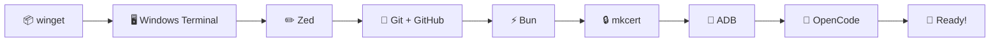

# 🪟 Windows Complete Setup

> From zero to a running development environment on Windows.



⏱️ **Estimated time:** ~30 minutes
📋 **Prerequisites:** Windows 10/11, nothing else

---

## ⚠️ Windows Gotchas — Read this first!

> **🔑 Administrator Rights:** Many commands in this guide need admin privileges. Start by opening Windows Terminal **as Administrator**:
>
> 1. Press the **Windows key**
> 2. Type **"Terminal"**
> 3. Right-click **"Windows Terminal"** (or "Terminal")
> 4. Click **"Run as administrator"**
> 5. A popup asks _"Do you want to allow this app to make changes?"_ → Click **"Yes"**
>
> **Use this admin terminal for the entire guide.**

---

## Step 1 — 📦 winget (Package Manager)

winget is like an **app store for developer tools** — built right into Windows. Instead of downloading installers from websites, you type one command and winget handles the rest.

**Good news:** winget is already installed on Windows 10 (1709+) and Windows 11!

Open **Windows Terminal as Administrator** (see gotchas above) and verify:

```powershell
# Check if winget is available
winget --version
```

You should see something like:
```
v1.x.xxxx
```

**✅ Verify:** You see a version number.

> ⚠️ **"winget is not recognized"?** Update the **App Installer** from the Microsoft Store. Search for "App Installer" in the Store and click "Update".

---

## Step 2 — 🖥️ Windows Terminal

A terminal is your **command center** — it's where you type commands to install tools, run your project, and interact with your code.

**Good news:** Windows Terminal comes pre-installed on Windows 11! On Windows 10, install it:

```powershell
# Install Windows Terminal (Windows 10 only)
winget install Microsoft.WindowsTerminal
```

**✅ Verify:** Press the Windows key, type "Terminal" — you should see Windows Terminal.

**💡 Tip:** Pin Windows Terminal to your taskbar — you'll use it a lot!

---

## Step 3 — ✏️ Zed (Code Editor)

Zed is where you'll **write and read code**. It's fast, has a built-in terminal, and supports all the languages we use.

```powershell
# Install Zed
winget install Zed.Zed
```

**✅ Verify:** Press the Windows key, type "Zed", and open it.

**Quick settings (optional):**
- Open Settings: `Ctrl + ,`
- Increase font size: look for `"ui_font_size"` and `"buffer_font_size"`
- Change theme: `Ctrl + K`, then `Ctrl + T`

**💡 Built-in terminal:** Press `` Ctrl + ` `` (control + backtick) to open a terminal inside Zed. You can run commands right where you write code!

---

## Step 4 — 🔧 Git + GitHub (Version Control)

Git is like **save points in a video game** — it tracks every change you make to your code, so you can always go back if something breaks. **GitHub** is the online platform where the team shares code, reviews changes, and collaborates.

### 4a — Install Git

```powershell
# Install Git
winget install Git.Git
```

> ⚠️ **Close and reopen your terminal** after installing Git so Windows recognizes the new `git` command.

**Now configure Git with your name and email:**

```powershell
# Set your name (replace with YOUR name)
git config --global user.name "Your Name"

# Set your email (replace with YOUR email — use the same one as your GitHub account!)
git config --global user.email "your.email@example.com"
```

**✅ Verify:**
```powershell
git --version
```

You should see something like:
```
git version 2.x.x.windows.x
```

> ⚠️ **"git is not recognized"?** Close your terminal completely and open a new one. If it still doesn't work, restart your computer — Windows needs to update the PATH.

### 4b — Create a GitHub account

If you don't have a GitHub account yet:

1. Go to [github.com](https://github.com) in your browser
2. Click **"Sign up"**
3. Use your **university email** (or any email)
4. Choose a username you'll be happy with — this is your developer identity!
5. Verify your email

> 💡 **Pro tip:** Apply for the [GitHub Student Developer Pack](https://education.github.com/pack) — it's free and includes Copilot, private repos, and more.

### 4c — Install GitHub CLI (`gh`)

The GitHub CLI lets you interact with GitHub **from your terminal** — create pull requests, review code, manage issues, all without leaving the command line.

```powershell
# Install GitHub CLI
winget install GitHub.cli
```

> ⚠️ **Close and reopen your terminal** after installing.

**Now log in to your GitHub account:**

```powershell
# Authenticate with GitHub
gh auth login
```

The CLI will guide you through the login:
1. **Where do you use GitHub?** → `GitHub.com`
2. **Preferred protocol?** → `HTTPS`
3. **Authenticate?** → `Login with a web browser`
4. It shows a **one-time code** — copy it
5. Your browser opens → paste the code → click **"Authorize"**

**✅ Verify:**
```powershell
gh auth status
```

You should see something like:
```
✓ Logged in to github.com as YourUsername
```

> ⚠️ **Browser didn't open?** Copy the URL shown in the terminal and paste it into your browser manually.

> 📖 **Want to learn more?** See [GitHub Basics](github-basics.md) for branches, pull requests, and the team workflow.

---

## Step 5 — ⚡ Bun (JavaScript Runtime)

Bun is the **engine that runs your code**. Think of it like a car engine — your code is the steering wheel, but Bun is what actually makes things move.

```powershell
# Install Bun
powershell -c "irm bun.sh/install.ps1 | iex"
```

> ⚠️ **Close and reopen your terminal** after installing Bun.

**✅ Verify:**
```powershell
bun --version
```

You should see something like:
```
1.x.x
```

> ⚠️ **"bun is not recognized"?** Close your terminal and open a new one. Bun adds itself to your PATH, but the current terminal doesn't know about it yet.

---

## Step 6 — 🔒 mkcert (HTTPS Certificates)

VR in the browser (WebXR) only works over **HTTPS** — a secure connection. mkcert creates certificates that make your local computer trusted for HTTPS.

```powershell
# Install mkcert
winget install FiloSottile.mkcert

# Install the local certificate authority (one-time setup, requires admin!)
mkcert -install
```

A popup may ask _"Do you want to install this certificate?"_ → Click **"Yes"**.

**✅ Verify:**
```powershell
mkcert --version
```

You should see something like:
```
v1.x.x
```

> ⚠️ **"mkcert is not recognized"?** Close and reopen your terminal. If it still doesn't work, restart your computer.

---

## Step 7 — 📱 ADB (USB Bridge to Quest)

ADB (Android Debug Bridge) connects your computer to the **Meta Quest** headset via USB cable. This lets you test your VR worlds directly on the Quest.

> 💡 **Only needed if you have a Meta Quest.** You can skip this step and come back later.

```powershell
# Install ADB via Google's platform tools
winget install Google.PlatformTools
```

> ⚠️ **Close and reopen your terminal** after installing ADB.

**✅ Verify:**
```powershell
adb version
```

You should see something like:
```
Android Debug Bridge version 1.0.x
```

> ⚠️ **"adb is not recognized"?** You may need to add ADB to your PATH manually:
> 1. Find where ADB was installed (usually `C:\Users\YourName\AppData\Local\Android\Sdk\platform-tools\`)
> 2. Press Windows key → type "environment variables" → click "Edit the system environment variables"
> 3. Click "Environment Variables" → under "User variables", find "Path" → click "Edit"
> 4. Click "New" → paste the ADB folder path → click "OK" everywhere
> 5. Close and reopen your terminal

---

## Step 8 — 🤖 OpenCode (AI Coding Assistant)

OpenCode is an **AI assistant that runs in your terminal**. You can ask it questions about the codebase, have it explain code, or even write code for you.

```powershell
# Install OpenCode
winget install sst.opencode
```

> ⚠️ If `winget` doesn't find the package, install via npm instead:
> ```powershell
> bun install -g opencode
> ```

**✅ Verify:**
```powershell
opencode --version
```

> 📖 **API Key Setup:** OpenCode requires an API key to work. Follow the official setup guide: [opencode.ai/docs](https://opencode.ai/docs/)

---

## ✅ Final Checklist

Open a **new terminal** and run all of these to confirm everything is installed:

```powershell
winget --version     # ✅ winget
git --version        # ✅ Git
gh auth status       # ✅ GitHub CLI (logged in)
bun --version        # ✅ Bun (1.0+)
mkcert --version     # ✅ mkcert
adb version          # ✅ ADB (optional)
opencode --version   # ✅ OpenCode
```

Open these apps to confirm they launch:
- ✅ **Windows Terminal** — your terminal
- ✅ **Zed** — your code editor

---

## 📺 Video Resources

Prefer watching? These videos cover the tools you just installed:

| Topic | Video | Duration |
|-------|-------|----------|
| ⌨️ Terminal | [Command Line Crash Course — Traversy Media](https://www.youtube.com/watch?v=uwAqEzhyjtw) | 45 min |
| ✏️ Zed | [Zed Editor 101 — Ultimate Setup Guide](https://www.youtube.com/watch?v=NAk4tyfIM3A) | 28 min |
| 🔧 Git | [Git and GitHub Course For Beginners](https://www.youtube.com/watch?v=bFHwtm6FQ4c) | 30 min |

---

## 🚀 Next Step

Your development environment is ready! Continue with:

👉 [**First Steps — Clone, Run, Explore**](first-steps.md)
